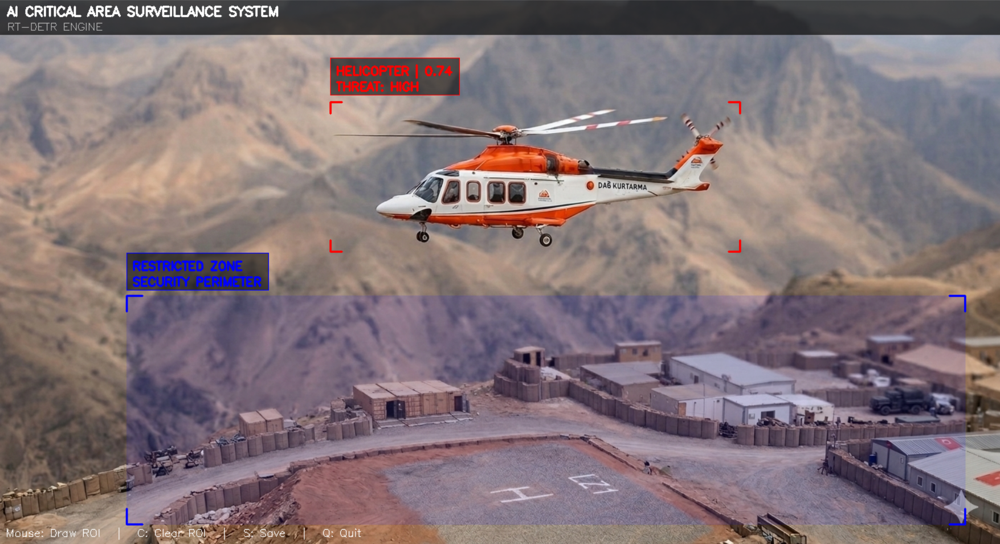
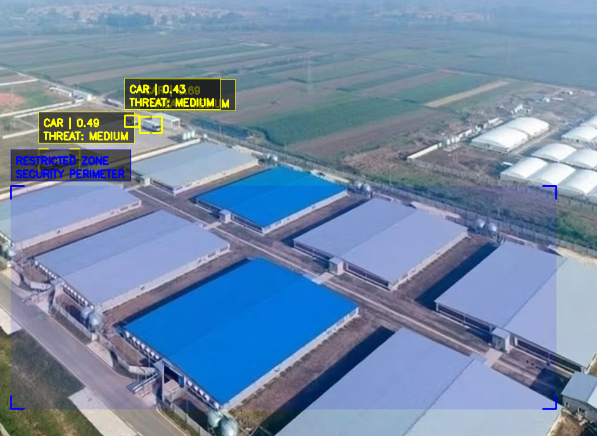

# AI Critical Area Surveillance System

<p align="center">
AI-powered aerial threat detection system using <b>RT-DETR</b> for monitoring restricted zones and protecting critical infrastructure.
</p>

<p align="center">


</p>
---

## Overview

This project presents an **AI-powered surveillance system designed to protect restricted areas and critical infrastructure** by detecting potential threats in real time.

The system analyzes **camera feeds, recorded videos, or static images** and applies **RT-DETR (Real-Time Detection Transformer)** to detect aerial and ground objects such as:

- helicopters
- drones
- vehicles
- trucks
- people

A user-defined **Restricted Zone (ROI)** represents the protected perimeter of a facility.

Whenever a detected object enters this area, the system evaluates the object's **threat level** and generates a **visual alert**.

The project demonstrates how modern computer vision techniques can be used to build **autonomous security monitoring systems for real-world surveillance scenarios.**

---

## System Demo


The demo above shows the real-time detection interface of the surveillance system.

Detected objects are highlighted with bounding boxes and classified with their **object type and threat level**.

The system continuously analyzes each frame and checks whether detected objects enter the **restricted security zone**, allowing operators to immediately identify potential threats.

---
## Full Demo Videos


🎥 **Helicopter Detection Demo**  
Watch on YouTube:[Helicopter Detection Video](https://youtube.com/shorts/cv427cC86T4?si=0zmz19CWnsWh_piZ)

🎥 **Helicopter Surveillance Demo**  
Watch on YouTube: [Helicopter Surveillance Video](https://youtube.com/shorts/DftkHMOKajw?si=8VRgPpNmujIM3k74)

🎥 **Drone Surveillance Demo**  
Watch on YouTube:[Drone Surveillance Video](https://youtube.com/shorts/CAmsZhQ0t6I?si=3fHBo2PA4WvD_uc9)

## Detection Examples

### Helicopter Threat Detection



This example demonstrates the detection of a helicopter approaching the monitored area.

Helicopters are classified as **high-risk aerial threats** due to their potential use in unauthorized surveillance or attacks.

If a helicopter enters the restricted zone, the system automatically triggers a **CRITICAL THREAT alert** to notify security operators.

---

### Facility Surveillance



The system can monitor large facilities such as industrial sites, logistics centers, and military installations.

Ground objects such as **vehicles, trucks, and personnel** are continuously tracked and evaluated.

If any of these objects enter the restricted security zone without authorization, the system generates an **intrusion alert**, allowing rapid response by security personnel.

---

## Detection Pipeline

The detection pipeline works as follows:
Input Source(Camera / Video / Image)
↓
Frame Processing
↓
RT-DETR Object Detection
↓
Object Classification
↓
Threat Level Analysis
↓
Restricted Zone Check
↓
Alert Generation

This pipeline allows the system to perform **continuous real-time monitoring**, automatically detecting objects and evaluating whether they pose a threat to the protected area.

---

## RT-DETR Architecture

The system uses **RT-DETR (Real-Time Detection Transformer)** for high-performance object detection.

RT-DETR combines:

- CNN backbone for feature extraction
- transformer encoder for global context
- detection head for object prediction

This allows efficient detection in **real-time surveillance environments**.

---

## Model Training

The detection model was trained using **RT-DETR architecture**.

Training steps included:

1. Dataset preparation
2. Annotation conversion to YOLO format
3. Dataset merging
4. Model training with Ultralytics RT-DETR

The trained model is stored as:
models/best.pt

---

## Dataset

The dataset includes aerial surveillance images containing objects such as:

- drone
- helicopter
- car
- truck
- person
- bird

Annotations were processed and converted to **YOLO format** before training.

Dataset files are not included in the repository due to size limitations.

---

## Threat Classification

| Object | Threat Level |
|------|------|
| Drone | HIGH |
| Helicopter | HIGH |
| Person | MEDIUM |
| Car | MEDIUM |
| Truck | MEDIUM |
| Bird | LOW |

---

## Key Features

- Real-time object detection using **RT-DETR**
- Restricted zone monitoring (ROI)
- Threat classification system
- Visual alert generation
- Works with camera, video, and image input
- AI-based aerial surveillance interface

---

## Technologies

- Python
- OpenCV
- PyTorch
- RT-DETR
- Ultralytics

---

## Project Structure
````
aerial-threat-surveillance/
│
├── src/
│   └── main.py
│
├── models/
│   └── best.pt
│
├── images/
│   ├── helicopter_detection.png
│   ├── facility_detection.png
│   └── demo.gif
│
├── video/
│   └── demo.mp4
│
├── scripts/
│   ├── train_rtdetr.py
│   └── convert_visdrone_to_yolo.py
│
├── dataset.yaml
├── requirements.txt
└── README.md
````
---

## Run the System

Run with camera
python src/main.py –source video.mp4

Run with image
python src/main.py –source image.png

---

## Controls

| Key | Action |
|----|----|
Mouse | Draw restricted zone |
C | Clear zone |
Q | Quit system |

---

## Applications

Possible real-world applications include:

- military base monitoring
- border surveillance
- critical infrastructure protection
- industrial facility security
- drone detection systems

---

## Future Improvements

- dedicated drone detection dataset
- multi-camera monitoring
- object tracking integration
- real-time alarm notification
- edge device deployment

---

## Author
Beyza Ece Deniz

AI surveillance prototype developed using **RT-DETR object detection**.
